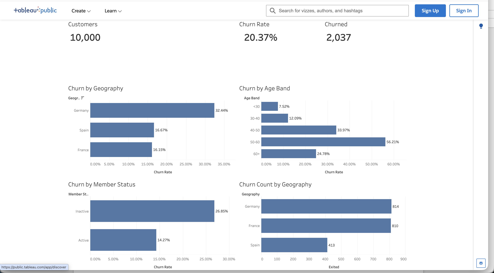

# Customer Churn Analysis Using SQL, Python, and Tableau

## Introduction

This project analyzes bank customer churn using Python, SQL, and Tableau. The goal is to identify which customer groups are most likely to leave and turn those patterns into a clear dashboard and practical recommendations.

## Methodology

I started by loading the raw dataset into Python and inspecting the structure, missing values, duplicates, and basic summary statistics. After that, I cleaned the data by removing columns that were not useful for analysis and created grouped fields for age, tenure, and balance. I then used SQL to calculate churn rates across different customer groups. Finally, I built a Tableau dashboard to visualize the main patterns.

## Tableau Dashboard

[View the Tableau Public dashboard](https://public.tableau.com/app/profile/jeremy.choi/viz/customer_churn_dashboard_17854665303090/CustomerChurnDashboard?publish=yesE)

## Insights

Customers in Germany show the highest churn rate in this dataset. Older customers, especially those in the 40 to 60 age range, churn more often than younger customers. Inactive members are much more likely to leave than active members. Customers with fewer products also tend to churn more often.

## Recommendations

Focus retention efforts on Germany first. Re-engage inactive customers earlier before they fully disengage. Build stronger relationships with customers who only use one product. Give older customers a more personal retention approach instead of generic outreach.

## Limitations

This analysis shows patterns, but it does not prove why customers left. The dataset does not include complaint history, customer satisfaction, or service issue data, so some reasons for churn may be missing. Some groups are also small, which can make percentages look more extreme than they really are.

## Files

- `notebooks/churn_eda.ipynb`
- `sql/churn_analysis.sql`
- `data/raw/bank_churn_raw.csv`
- `data/processed/bank_churn_clean.csv`
- `data/processed/bank_churn_enriched.csv`